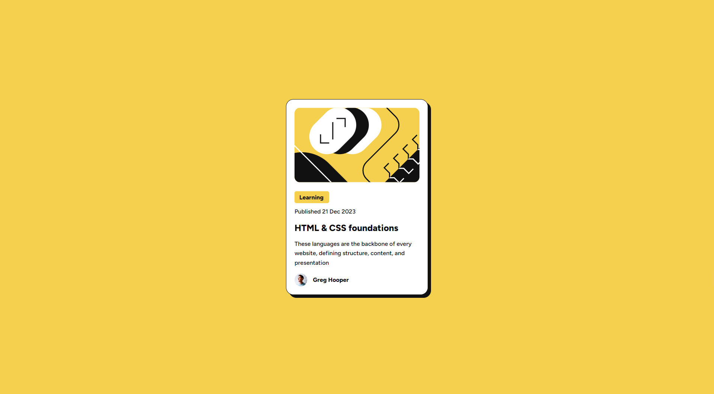
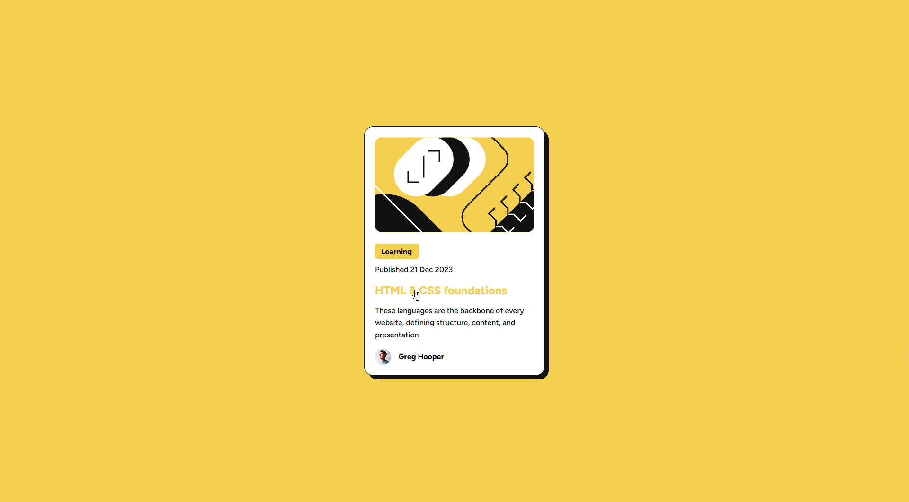

# Frontend Mentor - Blog preview card solution

This is a solution to the [Blog preview card challenge on Frontend Mentor](https://www.frontendmentor.io/challenges/blog-preview-card-ckPaj01IcS). Frontend Mentor challenges help you improve your coding skills by building realistic projects. 

## Table of contents
  - [Screenshot](#screenshot)
  - [Links](#links)
- [My process](#my-process)
  - [Built with](#built-with)
  - [What I learned](#what-i-learned)
  - [Useful resources](#useful-resources)
- [Author](#author)

### Screenshot

### Links

- Solution URL: [Add solution URL here](https://your-solution-url.com)
- Live Site URL: [Add live site URL here](https://your-live-site-url.com)

## My process
Really easy challange, putting everything together into containers makes it easy to create padding and spacing. Positioning it with flexbox inside a 100vh x 100% container makes it always centered, and using em values as padding/margin feels way more reliable.
### Built with

- Semantic HTML5 markup
- CSS custom properties
- Flexbox

### What I learned

Feeling more comfortable with using flexbox and relative values for padding/margin. A lot cleaner than the first challange i did here.

### Useful resources

- [Image Styling](https://www.w3schools.com/css/css3_images.asp) - Forgot how to make the icon smaller and this helped.
- [Box Shadow](https://developer.mozilla.org/en-US/docs/Web/CSS/box-shadow) - Really helpful guide for box shadow.

## Author

- Frontend Mentor - [@TheGroobi](https://www.frontendmentor.io/profile/TheGroobi)